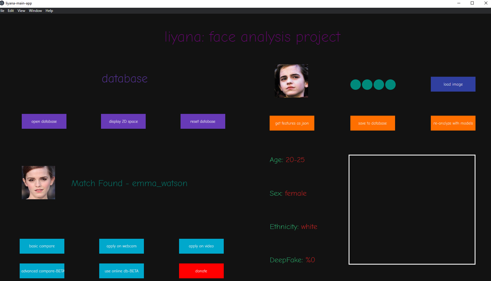

# liyana: face analysis project

[ ](https://twitter.com/tyburakk)                            [](https://www.twitch.tv/tyburak)                              [](https://www.youtube.com/channel/UC_ruNwRztPY_P4aUxbIFuOQ)


__For supporters, My Bitcoin/coin.space: 1LUFWnzrGVLdsZ7gnfee87iX6QqSn24Tvr__

__Thank you for donations, i am grateful.__

## Features

- Facial recognition with database
- Facial recognition on webcam
- Facial recognition on video
- Displaying 2D space which database lies on
- Age, sex and ethnicity detection
- DeepFake detection


## Features that expected to come in next versions

- Online database that every user can add face to common pool
- Face re-generation with extracted features
- Advanced video analysis





# Usage

## Python Side

- Install libraries with ``` pip install -r requirements.txt ``` 
- Download a model from [face recognition folder](/face_recognition/), extract it, copy *arcface_final.h5* to *main_app/python_server/arcface_final.h5*
- Run *main_app/python_server/server.py*
- If you don't need a GUI, run *main_app/python_server/client.py*. Commands are listed in [here](/main_app/python_server/tensorflow_worker.py).

I highly recommend to use a GPU, you can follow [those](https://www.tensorflow.org/install/gpu) steps if you have one.


## Electron Side

- Install electron with npm. Check [this page](https://www.electronjs.org/docs/tutorial/installation) for help.
- Go */main_app/electron_scripts* and run ```electron .```  while python server is running. 


I will add a video to YouTube to explain how you can install and how it works, stay tuned.