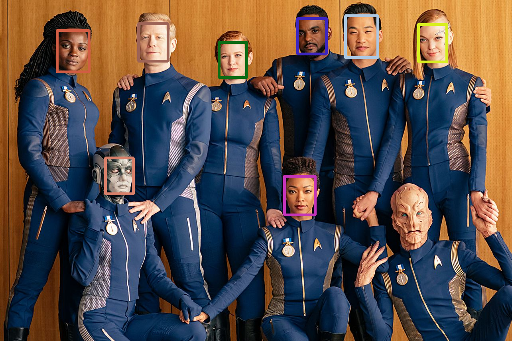
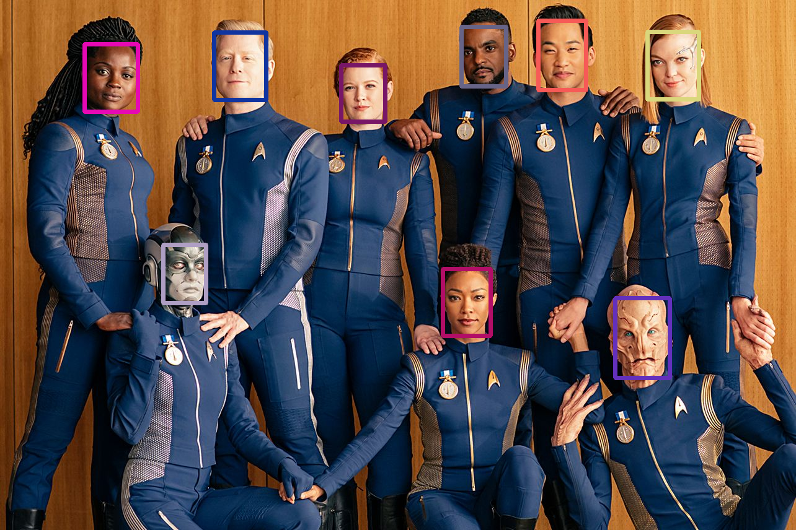

# Face Detection Scripts

## [Main Detector](detector_main.py)

Common functions like loading images and videos, displaying them, generating color vs.

## [MTCNN Detector](mtcnn_detector.py)

Face Detection with [MTCNN](https://github.com/ipazc/mtcnn)

> You can see that MTCNN couldn't detect Mr. Saru :(

## [RetinaFace Detector](retina_detector.py)

Face Detection with [Retina Face](https://arxiv.org/pdf/1905.00641v2.pdf), library taken from [InsightFace](https://github.com/deepinsight/insightface)

> Well, hello Mr. Saru :) 

# TODO 

- Train my own RetinaFace model with TensorFlow 2.x

